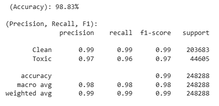
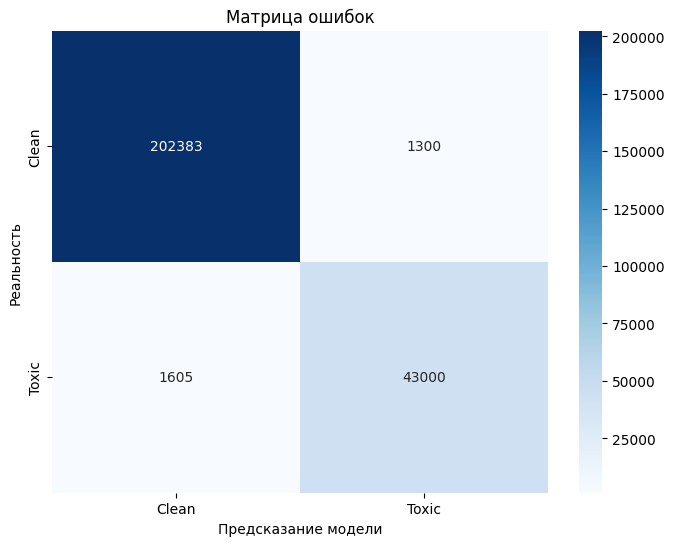

# 🇷🇺 Russian Hate Speech Classifier (RuBERT)

Проект по разработке классификатора токсичного контента и агрессивных высказываний в русскоязычных текстах.

## 🎯 Задача
Автоматическое выявление Hate Speech в комментариях и сообщениях. Задача решена как бинарная классификация:
- **0 (Neutral):** Безопасный контент.
- **1 (Toxic):** Агрессия, оскорбления, токсичное поведение.

## 🛠 Технологический стек
- **Core:** Python, PyTorch
- **Model:** `DeepPavlov/rubert-base-cased` (Fine-tuning)
- **Data:** Transformers (Hugging Face), Scikit-learn
- **Hardware:** Обучено с использованием NVIDIA T4 GPU (Google Colab)

## 📊 Анализ ошибок (Error Analysis)
Вместо простой оценки метрик, был проведен ручный разбор сложных случаев, на которых модель ошибается. Это позволило выделить границы применимости текущего решения:

### ⚠️ Ложноположительные (False Positives)
Модель склонна помечать как "Toxic" тексты с общим негативным эмоциональным фоном, даже если они не содержат прямой агрессии к собеседнику:
- Бытовые конфликты и жалобы (например, обсуждение семейных проблем со свекровью).
- Резкие оценочные суждения о преступности («уничтожала бы насильников»).

### ❌ Ложноотрицательные (False Negatives)
Случаи, в которых агрессия скрыта за сленгом или метафорами, которые RuBERT сложнее уловить без специфического датасета:
- Зооморфизмы-оскорбления: *«гамадрила»*, *«крыса»*, *«скотина»*.
- Специфический сленг и пожелания вреда в непрямой форме (например, метафоры про «отрезание крыльев»).
- Использование обсценной лексики в искаженном написании (выродок, ублюдки).

## 📂 Структура проекта
- `src/model.py` — Архитектура классификатора на базе PyTorch nn.Module.
- `src/data_utils.py` — Логика подготовки данных (Custom Dataset & Tokenization).
- `predict.py` — Инференс-скрипт для быстрой проверки произвольного текста.
- `petproject_hatespeech.ipynb` — Исходный ноутбук с процессом обучения, логами и графиками.

---
## 📊 Результаты обучения
Ниже представлены графики процесса обучения и матрица ошибок, полученные в ходе экспериментов.

### Графики обучения (Loss и Accuracy)


*Модель быстро сходится: уже к 3-й эпохе точность (Accuracy) стабилизируется, а функция потерь (Loss) минимизируется.*

### Матрица ошибок (Confusion Matrix)


*Матрица подтверждает высокую предсказательную способность модели. Основные ошибки сосредоточены в зоне False Positives, что показано в разделе Error Analysis.*

## 🚀 Как запустить
Вы можете проверить работу классификатора в одну ячейку прямо в Google Colab или локальном терминале:

```bash
git clone [https://github.com/Dr0n41kL0xness/russian_hatespeech_classifier.git](https://github.com/Dr0n41kL0xness/russian_hatespeech_classifier.git)

cd russian_hatespeech_classifier

python predict.py
```
> **Примечание:** Обученная модель (fine-tuned) автоматически подгружается из моего репозитория на [Hugging Face](https://huggingface.co/Dr0n41k/rubert-toxic-classifier).
